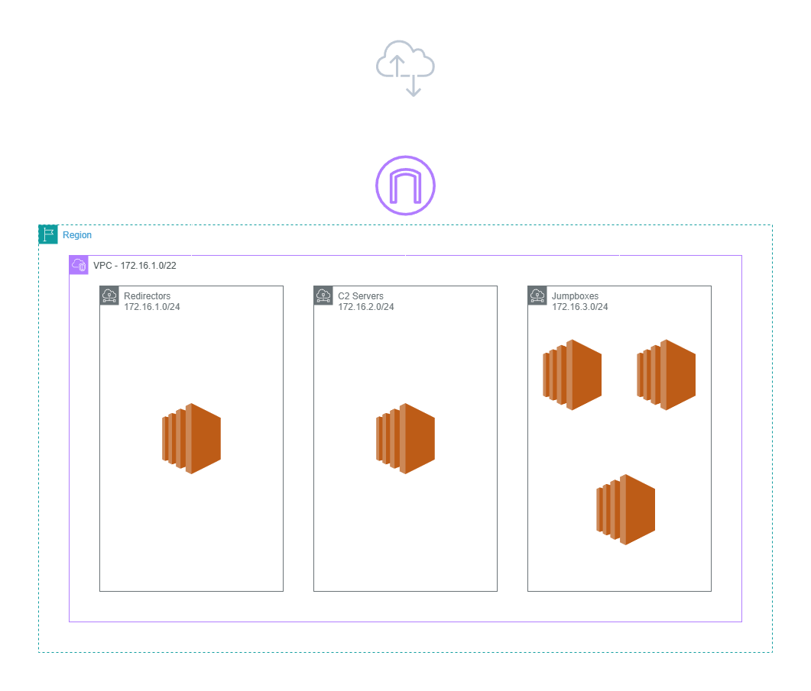

# Usage

## Prerequisites

* Ensure that you have a configured AWS account
* Ensure that [AWS-CLI](https://aws.amazon.com/cli/) is installed and configured for terraform usage

## Installation

Ensure you edit the `OPERATOR_IPS` and `ROE_IPS` variables within the `vars.tf` file to include your ROE and operator CIDR ranges.

```
git clone https://github.com/0xFFaraday/Testudo.git && cd Testudo

terraform -chdir=provider/aws init
# If no issues, lets plan this terraform project

terraform -chdir=provider/aws plan
# If these settings look good, we can then deploy

terraform -chdir=provider/aws apply --auto-approve
# If successful, you will be able to see the output of the public IPs to access via SSH / RDP
```

## Connecting / Ansible Provisioning

```
# Ansible controller
ssh -i ./linux-key-pair.pem ubuntu@ANSIBLE_PUBLIC_IP

# Provision with ansible
cd ~/ansible && ansible-playbook -i data/inventory main.yml
```

Now choose a beverage of your choice and wait. Once Ansible is finished, you and your team will have infrastructure ready to go for your operation! It is highly recommended to change all the default credentials since provisioning is now finished.

## Final Configuration

Now you should be able to use RDP with the specified credentials within `ansible/data/config.json` or SSH directly to the linux jumpbox with the key `linux-key-pair.pem` to finish configuring your team's redirectors and C2 servers.

## Subnet Layout

|    Hosts    |    Subnets    |
| :---------: | :-----------: |
| Redirectors | 172.16.1.0/24 |
|  C2 Servers | 172.16.2.0/24 |
|  Jumpboxes  | 172.16.3.0/24 |

## AWS Diagram

<figure><figcaption></figcaption></figure>

